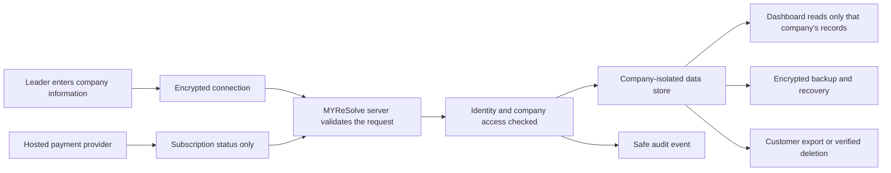

# MYReSolve Security and Data Blueprint

**Status:** Draft for Product Owner review; planning only

**Date:** 2026-07-19

**Approved planning baseline:** `main` at `8c01b3ab080646e21a5eb90f74e8dbf43417e239`

**Implementation status:** Not started

## 1. Purpose

This blueprint defines how MYReSolve must protect company and personal data before it offers cloud accounts or paid subscriptions.

In simple terms, the service must:

- collect only the information it genuinely needs
- keep each customer's company data separate
- let only authorised people see or change that data
- use specialist providers for identity and payments
- encrypt company data in transit and at rest
- record important access and administration events safely
- support export, retention and verified deletion
- remain recoverable if systems fail
- explain its practices honestly to customers

This document does not approve a supplier or authorise development. It turns the security gate in `docs/SUBSCRIPTION_MVP_BRIEF.md` into an implementable design and evidence checklist.

## 2. Governing principles

1. **Privacy and security by design:** safeguards are designed before customer data is collected, not added after launch.
2. **Minimum necessary data:** MYReSolve collects only what is required for the agreed customer purpose.
3. **Deny by default:** access is refused unless identity, company membership, role and action are all permitted.
4. **Company separation:** one company must never be able to see or affect another company's data.
5. **No hidden reuse:** customer assessment, KPI or financial data is not sold or reused for advertising.
6. **Human accountability:** every control, supplier, incident and release decision has a named owner.
7. **Evidence before claims:** the landing page and sales material only describe protections that have been implemented and verified.
8. **Safe failure:** outages or invalid requests must not expose data or weaken access controls.

## 3. Data boundary

### 3.1 Information MYReSolve may need

| Data category | Examples | Classification | Primary purpose |
|---|---|---|---|
| Public website content | headings, body copy, SEO metadata | Public | Explain MYReSolve |
| Account identity | name, work email, verified status, role, MFA status | Personal / Confidential | Sign-in and access control |
| Company membership | company identifier, user identifier, role, invitation status | Confidential | Separate companies and control access |
| Organisation Profile | company name, sector, scale, operating models | Confidential Company Data | Provide assessment context |
| Assessment evidence | answers, confidence selections, dates and calculated results | Confidential Company Data | Produce and compare assessments |
| KPI evidence | definition, owner, period, Current, Acceptable, Target, source, quality note | Confidential Company Data | Track actual performance |
| Financial context | approved cost ranges and model inputs | Highly Confidential Company Data | Produce illustrative exposure estimates |
| Improvement activity | priorities, owners, target dates, progress notes | Confidential Company Data | Track improvement over time |
| Billing references | plan, subscription state, provider customer ID, invoice reference | Confidential | Operate subscriptions |
| Security events | sign-in, role change, export, deletion, admin access | Restricted operational metadata | Detect misuse and support investigation |
| Support records | contact details and minimum issue description | Confidential | Resolve customer queries |

Every field must have an approved purpose, owner, retention rule and deletion behaviour before it is added.

### 3.2 Information MYReSolve must not collect or store in the MVP

- payment card numbers, security codes or bank credentials
- passwords in MYReSolve application storage
- special-category personal data unless separately assessed and explicitly approved
- employee-level performance, health or disciplinary records
- customer lists or individual customer records from subscribing companies
- unrestricted document uploads
- production secrets, tokens or encryption keys in application data
- production company data in Sanity
- production company data in development, screenshots, demonstrations or AI tools
- data collected merely because it may be useful later

Payment credentials should be handled by a PCI DSS validated payment provider through hosted checkout. Authentication credentials should be handled by an approved identity provider.

## 4. End-to-end data journey

### 4.1 Before account creation

- The public landing page may use Sanity for approved wording and SEO only.
- The current free assessment remains browser-local until cloud migration is explicitly approved.
- The customer sees clear privacy information before entering company data.
- No browser-local assessment is moved to the cloud without a clear choice and explicit confirmation.

### 4.2 Account creation and sign-in

- The identity provider verifies the work email address.
- MFA is required for paid customer accounts and all MYReSolve administrator accounts.
- The application receives only the identity information required to establish a secure session.
- Sessions expire, can be revoked and are protected against theft and reuse.
- Password reset and account recovery must not bypass MFA or company access checks.

### 4.3 Company workspace creation

- Each workspace receives an internal, non-guessable company identifier.
- The first approved customer becomes the workspace Owner.
- Invitations expire and can be revoked.
- Accepting an invitation requires a verified account and an exact match to the intended invitation.
- Company membership is checked by the server on every protected request.

### 4.4 Data entry and processing

- The browser sends data over an encrypted connection.
- The server validates type, length, allowed values and business rules.
- The server determines the company from the authenticated membership; it does not trust a company identifier supplied by the browser.
- Calculations run using approved, versioned assessment logic.
- Database queries and writes are restricted to the authenticated company and permitted role.
- Sensitive values are never written to application or monitoring logs.

### 4.5 Dashboard, reports and exports

- The same company and role checks apply to every dashboard, report and export.
- Export creation is recorded as an audit event.
- Download links are short-lived and restricted to the requesting authorised user.
- Reports display the company, assessment version and date needed to understand the result.
- Cached responses must never be shared between companies.

### 4.6 Billing

- Checkout is hosted by a validated payment provider.
- MYReSolve stores provider references and subscription status, not card details.
- Signed provider events update subscription state on the server.
- A browser message alone can never activate paid access.
- Billing events are idempotent so retries cannot create duplicate or contradictory states.
- Cancellation stops renewal while preserving or deleting customer data according to the approved policy.

### 4.7 Export, retention and deletion

- A company Owner can request a structured export of approved company data.
- Identity is rechecked before a high-risk export or deletion action.
- Deletion has a confirmation step, a defined recovery window and an auditable completion record.
- Retention expiry removes data from active systems and follows the documented backup lifecycle.
- Supplier deletion responsibilities are included in contracts and operational procedures.

## 5. Company separation model

Company separation is the most important product security boundary.

Every company-owned record must include an immutable internal `organisation_id`. Every server-side read, update, export and delete must be scoped through the authenticated user's active membership.

The implementation must use several overlapping protections:

1. **Application checks:** the server checks identity, active membership, role and action.
2. **Database enforcement:** row-level security or an approved equivalent restricts records by company.
3. **Safe identifiers:** public identifiers are non-sequential and do not reveal record counts.
4. **Restricted service credentials:** application credentials cannot bypass separation without a narrowly controlled administrative need.
5. **Cache separation:** company and user scope form part of every private cache key; private responses are not publicly cached.
6. **Background-job separation:** jobs carry a validated company context and cannot scan all companies by default.
7. **Export separation:** export queries use the same enforced company boundary as the application.
8. **Automated negative tests:** tests actively attempt cross-company reads, changes, exports and deletion.

No production launch is permitted until tenant-isolation tests pass against APIs, database access, reports, search, caches, logs, backups and administrative tools.

## 6. Roles and access

The first subscription should use a small permission model.

| Action | Owner | Admin | Member | MYReSolve support |
|---|---:|---:|---:|---:|
| View company dashboard | Yes | Yes | Yes | No by default |
| Enter assessment and KPI evidence | Yes | Yes | Yes | No by default |
| Invite or remove Members | Yes | Yes | No | No |
| Change Admin roles | Yes | No | No | No |
| Change or transfer Owner | Yes, with re-authentication | No | No | Controlled recovery only |
| Manage subscription | Yes | No | No | No |
| Export company data | Yes, with re-authentication | No | No | No |
| Request company deletion | Yes, with re-authentication | No | No | No |
| Access production company content | Yes | Yes | Yes | Exceptional, approved and audited |

Support may see the minimum subscription status needed to answer a billing query but cannot act as the customer to change the subscription. Access to customer workspace content must be exceptional, time-limited, justified, customer-approved, visible, revocable and logged. Support staff should use metadata and customer-shared redacted information wherever possible.

## 7. Technical security controls

### 7.1 Identity and sessions

- verified email and MFA
- secure, short-lived sessions with server-side revocation
- protection against account enumeration, brute force and credential stuffing
- re-authentication for Owner transfer, export, deletion and security changes
- secure invitation and recovery flows
- separate, strongly protected MYReSolve administrative identities

### 7.2 Encryption and secrets

- current TLS for data in transit
- managed encryption at rest for databases, backups and object storage
- secrets stored in a managed secret service, never source code or browser bundles
- separate secrets and encryption contexts for production and non-production
- documented rotation and emergency-revocation procedures
- supplier-managed keys initially unless a documented risk requires customer-managed keys

### 7.3 Application and API protection

- server-side schema validation and length limits
- parameterised database access
- output encoding and content security policy
- cross-site request and session protections appropriate to the chosen framework
- rate limits for sign-in, invitations, exports, webhooks and expensive calculations
- safe error messages that reveal no company data, identifiers or internal details
- signed webhook verification with replay protection
- dependency, code and secret scanning
- OWASP ASVS 5.0.0 Level 2 as the proposed verification baseline

### 7.4 Logging and detection

Record:

- successful and failed authentication events
- MFA and recovery changes
- invitations and membership changes
- Owner and Admin role changes
- exports and deletion requests
- billing-status changes
- MYReSolve administrative access
- security-control and configuration changes

Do not record:

- assessment answers
- KPI or financial values
- authentication tokens or passwords
- full exports
- payment card data
- unnecessary personal information

Security events must be protected from alteration, retained for an approved period, monitored for suspicious behaviour and linked to an incident process.

### 7.5 Secure environments

- production, test and development are separate
- production data is never copied into non-production
- tests and demos use synthetic organisations and users
- production changes require review and a recorded deployment
- administrative production access is least-privilege and periodically reviewed
- emergency access is time-limited and reviewed after use

## 8. Availability, backup and recovery

Before launch, MYReSolve must approve measurable recovery targets. Proposed starting targets for discussion are:

- **Recovery Point Objective:** no more than 24 hours of customer data loss
- **Recovery Time Objective:** restore the core customer service within 8 hours

These are planning targets, not customer promises.

The recovery design must include:

- encrypted automated backups
- backup separation from the primary service
- defined retention and deletion propagation
- restoration into an isolated environment
- at least one successful end-to-end restoration test before launch
- regular recovery exercises with recorded results
- a manual customer communication route if the application is unavailable

## 9. Threats that must be tested

| Threat | Required protection and evidence |
|---|---|
| One company accesses another company's records | Deny-by-default authorisation, database policy and automated cross-tenant tests |
| Account takeover | MFA, secure recovery, rate limits, session revocation and alerts |
| Privileged misuse | Least privilege, time-limited support access, audit trail and access reviews |
| Data exposed through logs or errors | Redaction rules, safe errors and log-content tests |
| Export link shared or guessed | Authorisation, short expiry, non-guessable link and audit event |
| Malicious file or script input | No unrestricted uploads; validation, encoding and content restrictions |
| Payment event forged or replayed | Signed webhook validation, timestamp/replay controls and idempotency |
| Backup stolen or not recoverable | Encryption, access restriction and tested restoration |
| Supplier outage or breach | Supplier assessment, response contacts, graceful failure and exit plan |
| Administrator account compromised | Phishing-resistant MFA where supported, separate accounts and monitoring |
| Customer data sent to AI or test tools | Policy, technical restrictions, training and review of support workflows |

A formal threat model must identify the real architecture, trust boundaries and residual risks before implementation approval.

## 10. Supplier selection requirements

The identity, hosting, database, email, monitoring and payment suppliers must be assessed before selection.

The assessment must cover:

- service location and international data transfers
- contractual controller and processor responsibilities
- encryption and access-control capabilities
- customer separation and administrative access
- security certifications and current assurance evidence
- breach notification and incident support
- backup, availability and recovery commitments
- data export, deletion and contract termination
- sub-processors and change notifications
- MFA, audit logs and role controls
- cost at pilot and growth volumes
- vendor lock-in and migration options

For payments, prefer a hosted checkout from a PCI DSS validated provider so MYReSolve does not handle cardholder data directly. Outsourcing payment collection reduces scope but does not remove MYReSolve's responsibility to protect the website and provider integration.

No supplier is approved by this blueprint.

## 11. Privacy and legal readiness

Before collecting cloud account or company data, MYReSolve must complete and maintain:

- a data inventory and record of processing activities
- purpose and lawful-basis assessment for personal information
- privacy-by-design review and DPIA screening
- a DPIA where the processing is likely to create high risk
- customer privacy notice and service terms
- processor and sub-processor contracts
- international transfer assessment where applicable
- retention and deletion schedule
- data-subject request process
- personal-data breach assessment and notification process
- clear controller/processor responsibility for customer-provided personal data

This blueprint is a product and security plan, not legal advice. Final legal documents and obligations require appropriately qualified review.

## 12. Customer-facing trust wording

### 12.1 Current browser-local assessment

Subject to a final implementation check, the landing page may say:

> Your Organisation Profile and assessment answers stay in this browser. MYReSolve does not receive, sell or share this assessment data.

The wording must change before any assessment data is sent to a MYReSolve cloud service.

### 12.2 Future subscription

After the controls are implemented and verified, suitable wording may follow this structure:

> Your company data is encrypted in transit and at rest. Access is limited to authorised users in your company and approved MYReSolve personnel where support requires it. MYReSolve does not sell your assessment or KPI data. Approved service providers process limited information to operate the service, as explained in our Privacy Notice.

Do not publish this subscription wording until it matches the live system, supplier agreements and privacy notice.

MYReSolve must not say that data is "completely secure", "never shared" or protected by controls that have not been independently verified. Customers must be told about approved processors, legal disclosure, retention, export and deletion in clear language.

## 13. Incident response

The incident plan must define:

1. how an issue is detected and reported
2. who leads technical containment and business decisions
3. how evidence is preserved safely
4. how affected companies and data are identified
5. how legal and regulatory notification decisions are made
6. who communicates with customers and suppliers
7. how recovery is verified
8. how lessons and corrective actions are recorded

Contact details, deputies and an out-of-band communication route must be available when the main service is unavailable. The process must be rehearsed before launch.

## 14. Release gates

### Gate 1: Architecture approval

- data inventory and flows complete
- suppliers assessed but not necessarily contracted
- company separation and role model approved
- threat model reviewed
- privacy and DPIA screening completed

### Gate 2: Foundation verification

- identity, MFA, sessions and recovery tested
- company separation enforced at server and database layers
- secrets, encryption and environment separation verified
- safe audit logging operating
- export and deletion journeys tested

### Gate 3: Payment and product verification

- hosted checkout and signed events tested
- entitlement state cannot be forged by the browser
- backup restoration completed successfully
- accessibility, application tests and production build pass
- privacy notice, terms and support routes ready

### Gate 4: Independent security approval

- ASVS Level 2 evidence reviewed
- external penetration test complete
- all critical and high findings resolved
- residual risks accepted by named owners
- incident exercise completed
- controlled pilot explicitly approved

No production customer data or payment may be accepted before all four gates pass.

## 15. Required evidence pack

The launch record must contain:

- approved architecture and data-flow diagram
- field-level data inventory and retention schedule
- supplier and sub-processor register
- privacy assessment and DPIA decision
- threat model
- role and permission matrix
- tenant-isolation test report
- ASVS verification record
- vulnerability and dependency report
- penetration-test report and remediation evidence
- backup restoration result
- export and deletion test result
- incident-response exercise record
- administrator access review
- customer-facing trust wording and approval
- named Product Owner, security owner and incident owner
- final go/no-go decision

## 16. Delivery sequence

1. Approve this blueprint and the open decisions.
2. Create architecture options for identity, hosting, database and payments.
3. Perform supplier and privacy assessments.
4. Build the secure identity and company-isolation foundation with synthetic data.
5. Verify the foundation before adding assessment persistence.
6. Add cloud assessment and KPI data behind the verified controls.
7. Add hosted billing and entitlements.
8. Complete recovery, privacy, security and independent testing.
9. Run a controlled pilot with a small approved cohort.
10. Review evidence before any wider paid launch.

## 17. Decisions still required

The Product Owner must approve:

1. the initial customer type and data sensitivity assumptions
2. confirmation of the proposed Owner, Admin and Member permissions, including Owner-only billing, export and deletion
3. the identity-provider shortlist
4. the hosting and database shortlist, including data location
5. the hosted payment-provider shortlist
6. retention periods for active, cancelled and deleted accounts
7. the recovery targets and customer service commitments
8. the external security-testing budget and provider
9. the security, privacy and incident owners
10. the controlled pilot size and launch evidence reviewer

## 18. Explicit exclusions

This document does not approve:

- authentication, database, hosting or payment implementation
- a specific supplier
- production customer-data migration
- subscription prices
- employee-level or customer-level data ingestion
- AI access to customer company data
- changes to assessment or risk calculations
- a claim of compliance, certification or complete security
- public launch or collection of paid customer data

## 19. Reference baseline

The design and verification must re-check current official guidance at implementation and launch time:

- [ICO: Data protection by design and by default](https://ico.org.uk/for-organisations/uk-gdpr-guidance-and-resources/accountability-and-governance/guide-to-accountability-and-governance/data-protection-by-design-and-by-default/)
- [ICO: Designing products that protect privacy](https://ico.org.uk/for-organisations/uk-gdpr-guidance-and-resources/designing-products-that-protect-privacy/)
- [NCSC: The Cloud Security Principles](https://www.ncsc.gov.uk/collection/cloud/the-cloud-security-principles)
- [NCSC: Choosing a cloud provider](https://www.ncsc.gov.uk/collection/cloud/choosing-a-cloud-provider)
- [OWASP: Application Security Verification Standard](https://owasp.org/www-project-application-security-verification-standard/)
- [PCI Security Standards Council: PCI DSS](https://www.pcisecuritystandards.org/standards/pci-dss/)

Guidance review date for this draft: 2026-07-19.
