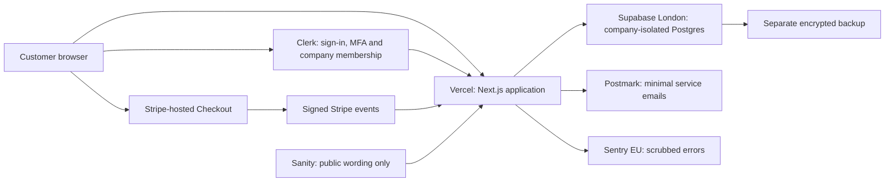

# MYReSolve Subscription Architecture Options

**Status:** Resumed for Product Owner review; planning only

**Date:** 2026-07-23

**Current planning baseline:** `main` at `fa97aaeb2076f69771d1bcbdc654617b4d46ca76`

**Implementation status:** Not started

**Resumption note:** Product Owner planning resumed on 2026-07-23. This document still does not approve supplier accounts, costs, subscription code, login, billing, database implementation or storage of real company data. Supplier capabilities, contracts, data locations and prices must be rechecked before purchase or implementation.

## 1. Simple recommendation

For the controlled subscription pilot, the recommended direction is:

- **Vercel Pro** to host the existing Next.js application
- **Clerk Pro** for customer login, mandatory MFA, invitations and company membership
- **Supabase Pro in the London region** for company assessment, KPI and subscription-reference data
- **Stripe-hosted Checkout and Billing** for subscriptions and card payments
- **Postmark Pro** for account and service emails, with short message retention
- **Sentry in its EU data region** for application errors, configured to remove customer content
- **a separate encrypted backup copy** outside the primary database supplier before customer launch
- **Sanity remains limited to public landing-page wording and SEO**

This is the best fit for the current product because it uses managed services for the highest-risk jobs while keeping the MYReSolve application responsible for its own company-data rules.

It is not a UK-sovereign design. Supabase can keep the primary company database in London, but Vercel, Clerk, Stripe, Postmark and Sentry may process limited information internationally under their contractual transfer arrangements. This must be assessed and explained before launch.

No supplier is approved or contracted by this document.

## 2. What each service would do

| Service | Simple role | Data it may process | Data it must not hold |
|---|---|---|---|
| Vercel | Runs the MYReSolve website and secure server code | web requests, secure session metadata and short-lived processing data | persistent assessment, KPI or card data |
| Clerk | Confirms who the user is and which company they belong to | name, work email, MFA, session, company membership and role context | assessment answers, KPI values and financial context |
| Supabase | Stores the customer's company information | Organisation Profile, assessment, KPI, financial model inputs, roles mirror and audit records | card data and public website content |
| Stripe | Takes payment and manages the subscription | customer billing identity, payment method and subscription state | assessment, KPI and dashboard content |
| Postmark | Sends verification, invitation and service messages | recipient email and minimum message content | assessment answers, KPI values, financial context and exports |
| Sentry | Alerts MYReSolve when the application fails | scrubbed technical error details | assessment answers, KPI values, tokens, passwords and exports |
| Separate backup store | Keeps an encrypted recovery copy | encrypted database backup | readable data without controlled restoration |
| Sanity | Lets approved editors change landing-page wording | public website content and SEO | accounts, company data, billing or authentication information |

## 3. Options considered

### Option A: Vercel plus Supabase Auth and Database

**Services:** Vercel, Supabase, Stripe, email provider and monitoring provider.

**Advantages**

- lowest initial fixed cost of the managed options
- fewer suppliers and fewer identity/database integration points
- Supabase Auth and Postgres Row Level Security work together directly
- MFA can be enforced using authentication-assurance level rules
- company database and authentication records can use the London region
- open Postgres database provides a reasonable exit path

**Disadvantages**

- MYReSolve must build and maintain company creation, invitations, membership and role administration
- secure account recovery and multi-company switching need more custom work
- tenancy mistakes are possible if the application and database policies diverge
- more product-security work falls on the MYReSolve team before the pilot

**Best when:** keeping suppliers and fixed cost low matters more than speed of building B2B account management.

**Assessment:** viable, but places too much identity and organisation-management work into the first secure release.

### Option B: Vercel, Clerk and Supabase

**Services:** Vercel, Clerk, Supabase, Stripe, Postmark and Sentry.

**Advantages**

- Clerk provides B2B Organizations, invitations, membership context and forced MFA
- prebuilt sign-in and account-recovery journeys reduce custom security-sensitive code
- Clerk and Supabase have documented third-party authentication integration
- Supabase Row Level Security provides a second data-separation layer
- Supabase can keep the primary company-data project in London
- all core services integrate with the existing Next.js application
- Postgres keeps the company-data model portable

**Disadvantages**

- more suppliers, contracts and failure points than Option A
- identity data may be processed outside the UK; transfer assessment is required
- Clerk organization membership and the MYReSolve database membership must be kept consistent
- custom role sets and larger organizations may require a paid Clerk add-on later
- using both signed identity context and database policies needs careful testing

**Best when:** a small team wants the safest practical route to a B2B subscription pilot without operating identity infrastructure.

**Assessment:** recommended for the pilot, subject to supplier, privacy and security review.

### Option C: AWS London managed architecture

**Services:** AWS hosting, Cognito, RDS Postgres, SES, S3 and monitoring, plus Stripe.

**Advantages**

- most application, identity, database, email, backup and monitoring services can be designed within one cloud account and region
- strong regional and enterprise-security capabilities
- detailed access, networking, encryption and audit controls
- fewer primary infrastructure contracts
- a strong route for customers that later require formal procurement evidence

**Disadvantages**

- highest implementation and operational complexity
- more specialist cloud-security knowledge is required
- more configuration creates more opportunities for security mistakes
- slower route to a controlled pilot
- cost is more difficult to predict because it is spread across many metered services
- the team would own more infrastructure, deployment and recovery work

**Best when:** strict regional control, complex procurement or enterprise-scale requirements justify the additional operational burden.

**Assessment:** a credible future or enterprise option, but not recommended for the first pilot without dedicated AWS security and operations capability.

## 4. Comparison

| Decision area | Option A: Vercel + Supabase | Option B: Vercel + Clerk + Supabase | Option C: AWS London |
|---|---|---|---|
| Fit with existing Next.js product | Strong | Strongest | Moderate |
| B2B company membership | Custom build | Managed foundation | Custom configuration |
| Mandatory MFA | Available, application-enforced | Managed forced-MFA flow | Available, configuration required |
| Database company separation | Supabase RLS | Clerk context plus Supabase RLS | RDS policy and application controls |
| Primary company-data region | London available | London available | London available |
| Identity-data transfer complexity | Lower | Higher | Lower if fully regionalised |
| Initial development effort | Medium | Lowest | Highest |
| Operational burden | Low to medium | Low to medium | High |
| Supplier count | Lower | Higher | Lower for infrastructure |
| Portability | Strong Postgres base | Strong Postgres base; identity migration needed | Strong database base; more infrastructure coupling |
| Pilot suitability | Good | **Recommended** | Poor without specialist support |

## 5. Recommended architecture

### 5.1 Vercel Pro

Use Vercel because the current product is already a Next.js application and Vercel provides managed deployment, TLS, DDoS mitigation, firewalling and a London compute region.

Required configuration:

- Pro plan for commercial use
- production functions pinned to London where supported
- public pages may use global caching; private pages and responses must not be publicly cached
- encrypted environment secrets with access limited to production maintainers
- protected preview deployments
- hard spending alerts and limits
- deployment audit and rollback process
- review Vercel's international processing and DPA before launch

Vercel's default function region is the United States, so London must be configured explicitly. Selecting London does not make all Vercel processing UK-only.

### 5.2 Clerk Pro

Use Clerk for authentication and company membership because the pilot needs secure sign-in, recovery, invitations, roles and mandatory MFA without MYReSolve building those high-risk flows from scratch.

Required configuration:

- Pro plan because forced MFA is required
- authenticator-app MFA enabled and required for every paid user
- organization membership required; personal workspaces disabled
- customer-created organizations restricted until the approved onboarding rules are implemented
- short, reviewed session lifetime
- secure invitation expiry and revocation
- no customer company content in Clerk metadata
- account and organization webhooks signed and replay-protected
- DPA, sub-processor list and UK transfer assessment completed

Clerk provides identity and organization context, but it does not replace MYReSolve's database-level company separation.

### 5.3 Supabase Pro in London

Use a dedicated production Supabase project in `eu-west-2` for company data.

Required configuration:

- Pro plan with spending cap and daily backups
- exact London region selected at project creation
- separate development, test and production projects
- Clerk enabled as the trusted third-party identity provider
- Row Level Security enabled on every company-owned table
- no browser access using a database service-role key
- every company record includes an immutable internal `organisation_id`
- RLS uses signed, server-controlled claims and database membership checks
- destructive actions require re-authentication and server approval
- database changes are versioned and reviewed
- point-in-time recovery reviewed before launch; daily backups alone meet only the proposed 24-hour recovery-point target
- independent encrypted backup and restoration test completed

Supabase's security certification does not make MYReSolve secure automatically. The database policies and application configuration remain MYReSolve's responsibility.

### 5.4 Stripe-hosted Checkout and Billing

Use Stripe-hosted Checkout so card information is entered on Stripe's page rather than MYReSolve's application.

Required configuration:

- Stripe-hosted payment page, not a MYReSolve-built card form
- Stripe Billing pay-as-you-go initially
- signed webhooks with timestamp and replay checks
- subscription status updated only by trusted server events
- customer billing portal for invoices, payment method and cancellation
- production and test accounts separated
- least-privilege dashboard roles and MFA
- no assessment, KPI or financial-risk content sent to Stripe
- annual review of PCI responsibilities and website controls

Hosted Checkout reduces MYReSolve's card-data exposure but does not remove responsibility for website and integration security.

### 5.5 Postmark Pro

Use Postmark initially for transactional account, invitation and service messages because it provides established delivery controls and adjustable retention.

Required configuration:

- no assessment, KPI, financial or export content in email
- minimum recipient and message metadata
- tracking disabled where it is not needed
- retention reduced to the shortest practical period, proposed seven days
- SPF, DKIM and DMARC configured
- separate production and test message streams
- DPA, sub-processors and US transfer assessment completed
- suppression-list retention understood and recorded

If UK-only email processing becomes a customer requirement, reassess Postmark and compare a regional service such as Amazon SES in London.

### 5.6 Sentry EU

Use Sentry's European data location for error monitoring, subject to a configuration review.

Required configuration:

- European data region selected when the organization is created
- send-default-personal-information disabled
- server and client scrubbing rules tested
- no session replay for authenticated company pages in the pilot
- no assessment answers, KPI values, financial data, exports, tokens or email bodies
- source maps protected
- alerts for authentication, authorization and unexpected server failures
- DPA and sub-processors reviewed

Monitoring must help detect failure without becoming another copy of customer data.

### 5.7 Separate backup

Supabase Pro provides daily backups retained for seven days. Before the pilot, MYReSolve also needs an encrypted logical backup outside the primary database supplier so a supplier or account failure does not remove every recovery copy.

The backup design decision must specify:

- approved secondary supplier and UK/EU region
- encryption before or during transfer
- separate least-privilege credentials
- 30-day proposed retention, subject to the approved data schedule
- deletion and cancellation behaviour
- monthly restoration test during the pilot
- named recovery owner

AWS S3 in London is a candidate, not an approved supplier.

## 6. Company-separation design

The recommended design uses two independent checks.

### Check 1: Clerk identity and active organization

Clerk confirms:

- the user has completed sign-in and MFA
- the user belongs to the selected organization
- the session carries signed organization context

### Check 2: Supabase database policy

Supabase confirms:

- the signed session is valid
- the organization exists in the MYReSolve database
- the user has an active mirrored membership
- the requested record has the same immutable `organisation_id`
- the requested action is permitted for the role

The database must deny the request when Clerk and the MYReSolve membership record disagree. Webhook delay, removed users, stale sessions and organization switching must be tested explicitly.

The initial internal roles remain:

- **Owner:** billing, export, deletion and role control
- **Admin:** member administration and company-data management
- **Member:** assessment and KPI contribution

Clerk may supply basic organization context, but MYReSolve remains the source of truth for application permissions and high-risk actions.

## 7. Indicative pilot cost

Prices below are public list prices checked on 2026-07-19. They exclude VAT, exchange-rate changes, usage overages, Sanity, security testing, legal advice and engineering. They must be rechecked before purchase.

| Service | Indicative starting cost | Notes |
|---|---:|---|
| Vercel Pro | USD 20/month | includes USD 20 usage credit; additional usage can apply |
| Clerk Pro | USD 20/month billed annually or USD 25 month-to-month | MFA included; basic B2B organization limits apply |
| Supabase Pro | USD 25/month | one Micro project covered by included compute credit; daily backups for seven days |
| Postmark Pro | USD 16.50/month | retention reduction may require an additional add-on starting at USD 5/month |
| Sentry | Start with the smallest suitable EU-region plan | final plan and event allowance require procurement confirmation |
| Separate backup | Usage-based | expected to be low for a small pilot; design and restore effort matter more than storage price |
| Stripe Payments | 1.5% + 20p for a standard UK card | higher rates apply to other cards and currencies |
| Stripe Billing | 0.7% of Billing volume | in addition to payment-processing fees |

The visible fixed software starting point is approximately **USD 82 to 92 per month**, plus Sentry, backup, Sanity, VAT and usage. The range reflects Clerk billing frequency and the possible Postmark retention add-on; exchange rates may also change the sterling cost.

This estimate is for technical comparison only. It is not an approved budget.

## 8. Data location and transfer position

The recommended design can keep the primary company assessment and KPI database in London. It cannot honestly promise that every item of data stays in the UK.

Before launch, the supplier register must record:

- data categories processed by each supplier
- processing and backup locations
- sub-processors
- controller and processor roles
- DPA status
- UK international-transfer mechanism and assessment
- retention and deletion behaviour
- breach-notification route
- contract exit and export process

The landing page and Privacy Notice must distinguish between:

- company content stored in the London database
- identity, payment, email and technical metadata processed by approved international suppliers
- public content stored in Sanity

## 9. Security and privacy decision gates

### Before creating supplier production accounts

- approve the recommendation and pilot budget
- approve the UK/international data position
- complete supplier due diligence and DPA review
- name Product Owner, security, privacy and incident owners
- approve the role and retention decisions

### Before writing application code

- complete the architecture and data-flow diagram
- complete DPIA screening and initial threat model
- define organization, membership and RLS policy tests
- approve secret, environment and deployment controls
- define test evidence and rollback

### Before storing synthetic cloud data

- development and test environments separated
- MFA operating for maintainers
- no production credentials or customer data present
- automated tenant-isolation tests operating
- safe logs and monitoring verified

### Before storing real customer data or taking payment

- all four gates in `docs/SECURITY_DATA_BLUEPRINT.md` passed
- independent penetration test completed
- critical and high findings resolved
- backup restoration and deletion tested
- privacy notice, terms, support and incident processes live
- controlled-pilot approval recorded

## 10. Recommended proof before full development

Build a short-lived technical proof using synthetic data only. It should demonstrate:

1. two synthetic companies with separate users
2. mandatory MFA
3. invitation and removal of a Member
4. an assessment record protected by `organisation_id`
5. automated attempts by Company A to read, change, export and delete Company B's record, all denied
6. a stale or removed membership denied
7. a private response never stored in a public cache
8. signed Stripe test events changing a synthetic entitlement
9. safe error monitoring with customer fields removed
10. backup restoration into an isolated test environment

The proof is disposable. Passing it does not authorise production data, but it reduces architecture risk before the full product is built.

## 11. Decisions required from the Product Owner

1. Approve or amend Option B as the preferred pilot architecture.
2. Confirm that international processing under reviewed DPAs is acceptable for the pilot, while keeping the primary company database in London.
3. Approve the indicative fixed software budget for supplier trials.
4. Confirm the initial roles: Owner, Admin and Member.
5. Approve mandatory authenticator-app MFA for all paid users.
6. Approve proposed seven-day email retention and 30-day external backup retention, subject to privacy review.
7. Decide whether the pilot requires point-in-time database recovery at approximately USD 100/month or whether daily backups plus the separate recovery copy are sufficient.
8. Name the people responsible for security, privacy and incidents.
9. Approve a synthetic-data technical proof as the next implementation step after Gate 1 planning evidence is complete.

## 12. Explicit exclusions

This document does not:

- create supplier accounts or accept supplier terms
- install dependencies or write integration code
- approve a production budget
- migrate browser-local customer data
- collect real company data or payment
- change the assessment or dashboard
- add pricing to the landing page
- claim UK-only hosting, certification or complete security
- replace legal, privacy or independent security advice

## 13. Official sources reviewed

Sources and prices must be rechecked before procurement and launch.

- [Vercel pricing](https://vercel.com/pricing)
- [Vercel regions](https://vercel.com/docs/regions)
- [Vercel security and compliance](https://vercel.com/docs/security/compliance)
- [Clerk pricing](https://clerk.com/pricing)
- [Clerk Organizations](https://clerk.com/docs/guides/organizations/overview)
- [Clerk mandatory MFA](https://clerk.com/docs/guides/configure/auth-strategies/sign-up-sign-in-options)
- [Clerk Data Processing Addendum](https://clerk.com/legal/dpa)
- [Supabase pricing](https://supabase.com/pricing)
- [Supabase regions](https://supabase.com/docs/guides/platform/regions)
- [Supabase third-party authentication](https://supabase.com/docs/guides/auth/third-party/overview)
- [Clerk and Supabase integration](https://clerk.com/docs/guides/development/integrations/databases/supabase)
- [Supabase Row Level Security](https://supabase.com/docs/guides/database/postgres/row-level-security)
- [Supabase security and SOC 2](https://supabase.com/docs/guides/security/soc-2-compliance)
- [Supabase point-in-time recovery](https://supabase.com/docs/guides/platform/manage-your-usage/point-in-time-recovery)
- [Stripe UK pricing](https://stripe.com/gb/pricing)
- [Stripe-hosted Checkout](https://docs.stripe.com/payments/checkout)
- [Postmark pricing](https://postmarkapp.com/pricing)
- [Postmark EU privacy and retention](https://postmarkapp.com/eu-privacy)
- [Sentry European data location](https://sentry.io/changelog/data-storage-location-in-germany-is-generally-available/)
- [NCSC Cloud Security Principles](https://www.ncsc.gov.uk/collection/cloud/the-cloud-security-principles)
- [ICO data protection by design and by default](https://ico.org.uk/for-organisations/uk-gdpr-guidance-and-resources/accountability-and-governance/guide-to-accountability-and-governance/data-protection-by-design-and-by-default/)

Research review date: 2026-07-19.
